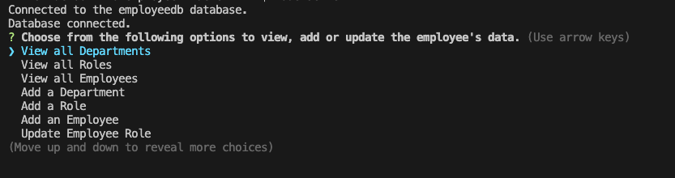

## Title
Employee Tracker

## Description
AS A business owner
I WANT to be able to view and manage the departments, roles, and employees in my company
SO THAT I can organize and plan my business

## Table of Contents
* [Description](#description)
* [Installation](#installation)
* [Usage](#usage)
* [Contact](#contact)

## Installation
Use 'npm init' to install the necessary npm packages to run this project.

## Usage
Use this application to view the companies' employee database.

## Contact
For any questions about this project, contact me at:
- Github: [vuelee0](https://github.com/vuelee0)
- Email: vuelee09@gmail.com

## Demo Video Link
https://drive.google.com/file/d/1I5EQ4yuJFpL8JgzOKNNdbX_mClobBm7d/view

## Screenshots

